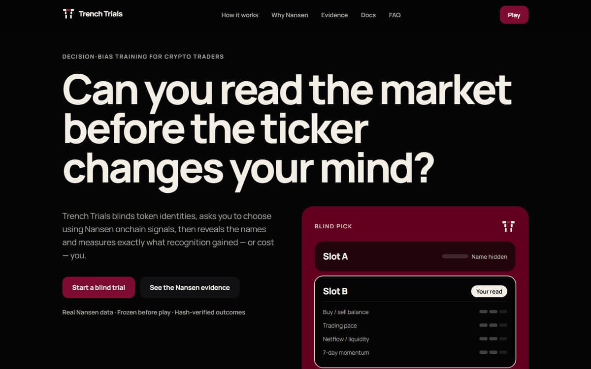
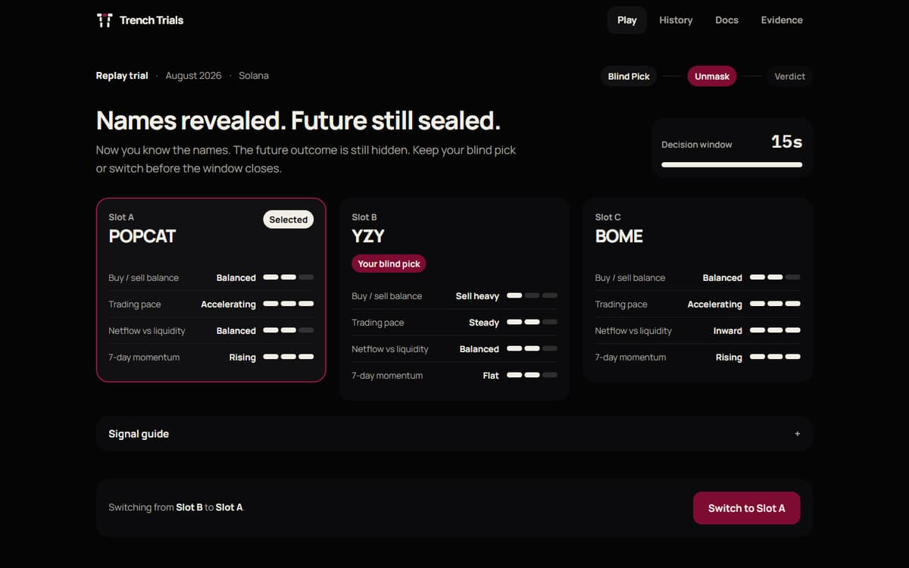
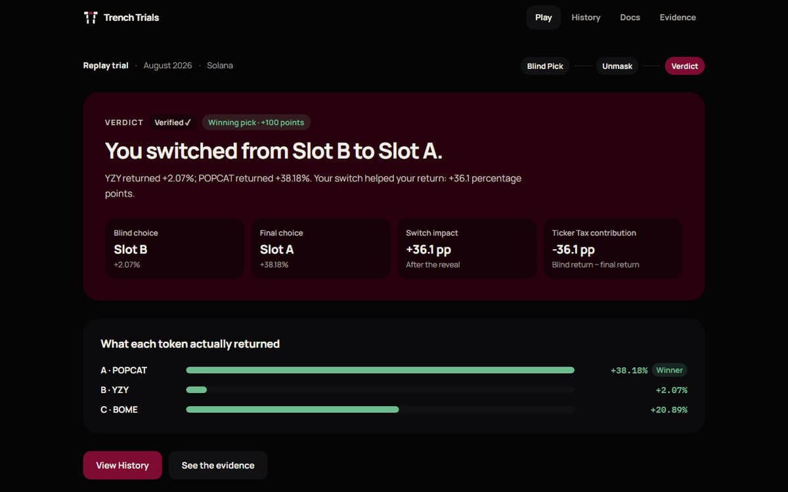
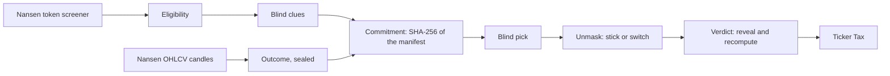
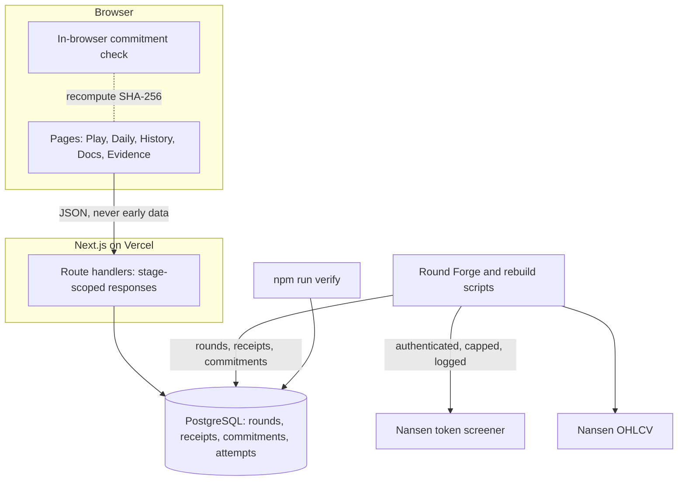

# Trench Trials

**Trench Trials is a Nansen-powered decision-bias training game for crypto traders: compare three anonymous tokens using frozen onchain signals, lock a blind choice, reveal their identities, stick or switch, then see exactly what ticker recognition gained or cost through your Ticker Tax.**

**Live:** [trench-trials.vercel.app](https://trench-trials.vercel.app) · **Evidence:** [/evidence](https://trench-trials.vercel.app/evidence) · **Docs:** [/docs](https://trench-trials.vercel.app/docs) · **Quickstart:** [run it locally in under ten minutes](#run-it-locally-in-under-ten-minutes)



## The problem

Crypto traders have more data than ever, but familiar tickers, reputation and narratives still influence their decisions. Ordinary prediction games and backtests record only the final choice, so they cannot tell whether the token’s identity changed the decision.

## How the Unmask mechanic works

Each trial shows a trader three anonymous assets using pre-cutoff Nansen signals.

1. **Blind pick.** Compare the three assets on four Nansen signals each. Names, addresses, dates and prices are hidden. Lock your pick.
2. **Unmask.** The names appear while the future stays hidden. Stick or switch, once, before the server-timed window closes.
3. **Verdict.** The real outcome is revealed. **Ticker Tax** (blind-pick return − final-pick return) measures what recognition gained or cost you.

| Unmask | Verdict |
| --- | --- |
|  |  |

<sub>Screenshots are taken by the Playwright suite from the production build. They show a stored historical round that is not in the playable catalog, so nothing playable is spoiled.</sub>

## Who it is for

**Individual crypto traders and analysts** who want to test whether they follow market signals or familiar narratives, and to measure and reduce narrative bias through repeated blinded decisions. A shared **Daily** trial gives trading communities a common calibration exercise.

## Why it is different

Prediction games ask whether you were right. **Trench Trials asks what the ticker changed.**

| | Measures |
| --- | --- |
| Dashboards | More information |
| Prediction games and backtests | The final call |
| **Trench Trials** | The difference between the choice before and after identity is revealed, priced against the real outcome |

## Why Nansen is load-bearing

Nansen supplies the candidate universe and the point-in-time market data used to construct every blind trial. Trench Trials deterministically selects eligible assets from that data, derives the blind clues, and uses Nansen price candles to calculate the outcome. **Without Nansen, no new Replay, Daily or Live round can be produced.**

- Candidate discovery, the four blind signals and every outcome come from Nansen.
- Replay generation, new Daily rounds, and Live capture and resolution all require Nansen.
- Historical inputs are frozen and hash-sealed before a player enters, so evidence cannot change after a decision and every verdict is reproducible. That is why existing rounds stay playable during a Nansen outage, and why playing makes no API call.
- There is no mock, substitute or fallback data source. Missing or malformed Nansen data prevents or invalidates a round.

| Nansen endpoint | Drives |
| --- | --- |
| Historical Token Screener `/api/v1beta1/token-screener/historical` | Which tokens qualify, and the four blind signals |
| Historical Token OHLCV `/api/v1beta1/tgm/historical-token-ohlcv` (1h) | Exact entry and exit prices, returns and the winner |
| Token Screener `/api/v1/token-screener` | Live candidate capture |
| Historical Token OHLCV (5m) | Live resolution |

## Product flow



## Architecture



The server decides what each stage may contain: blind responses carry only slot letters and signal buckets, names arrive after the blind lock, and prices after the final lock. Details: [ARCHITECTURE.md](ARCHITECTURE.md).

## Real API usage and evidence

- **Requirement:** 100 real Nansen API calls.
- **Requests logged by the application:** 116 (572 credits), each with its request ID and response SHA-256. Balance after the last call: 448 credits.
- **Earlier app calls:** 21, made before application logging existed; visible only on the Nansen dashboard.
- **Expected dashboard total:** 137 (21 + 116), pending dashboard confirmation.

The public [Evidence page](https://trench-trials.vercel.app/evidence) lists every playable round’s request IDs, response hashes and commitment, and re-checks them on each load. Full reconciliation: [docs/API-USAGE-EVIDENCE.md](docs/API-USAGE-EVIDENCE.md).

## Run it locally in under ten minutes

Requirements: Node 20+ and a PostgreSQL database (a free Supabase project works). **No Nansen API key is needed** to inspect and play the included rounds.

```bash
git clone https://github.com/TheWeirdDee/trench-trials.git
cd trench-trials
npm ci
cp .env.example .env.local        # set DATABASE_URL and SESSION_SECRET (see below)
npm run setup:demo -- --confirm   # migrate, import the six verified rounds, approve, assign today’s Daily, verify
npm run build && npm start        # http://localhost:3000
```

Generate `SESSION_SECRET` with `node -e "console.log(require('crypto').randomBytes(32).toString('hex'))"`. Measured from a clean copy to a playable app with all six rounds: **2 minutes 52 seconds** (install 49 s, setup 42 s, build 69 s, start 12 s).

`setup:demo` imports the bundles in [`data/verified-rounds/`](data/verified-rounds): all six playable rounds, as frozen, authenticated Nansen-derived evidence. Each holds the derived round manifest, request IDs and response hashes; raw Nansen responses are not redistributed. **No bundled data is synthetic.** A Nansen key is required only to generate new Replay, Daily or Live data. More: [SETUP.md](SETUP.md).

## Verification and tests

```bash
npm run verify           # recompute every commitment and return, check eligibility and the Daily schedule, reconcile receipts with the call log
npm run typecheck
npm run test:db:setup    # once: prepare the isolated tt_test schema
npm test                 # unit and integration tests, always in tt_test
npm run build && npx playwright test   # end-to-end, accessibility and security checks on the production build
```

Tests never touch production rows and never reach Nansen. Every script that writes is a dry run unless given `--confirm`.

## Documentation

| For | Read |
| --- | --- |
| Players | [/docs](https://trench-trials.vercel.app/docs): gameplay, scoring, privacy and FAQ |
| Judges and reviewers | [/evidence](https://trench-trials.vercel.app/evidence) · [API usage evidence](docs/API-USAGE-EVIDENCE.md) · [Known limitations](docs/KNOWN-LIMITATIONS.md) |
| Builders | [SETUP.md](SETUP.md) · [ARCHITECTURE.md](ARCHITECTURE.md) · [DATA-CONTRACT.md](DATA-CONTRACT.md) · [CONTRIBUTING.md](CONTRIBUTING.md) |
| Data integrity | [Nansen contract and data audit](docs/NANSEN-CONTRACT-AUDIT.md) · [SECURITY.md](SECURITY.md) |
| Operators | [Daily runbook](docs/DAILY-REAL-RUNBOOK.md) · [Live runbook](docs/LIVE-REAL-RUNBOOK.md) |

## Current scope

- Six playable rounds are included: two leak-free offline rebuilds and four Round Forge v4 rounds. More are added only when built from Nansen data, independently verified and approved.
- Live is withheld until a candidate round passes the eligibility policy.
- History is a browser-local anonymous profile; there are no accounts.
- Historical inputs are frozen for reproducibility.

Details: [docs/KNOWN-LIMITATIONS.md](docs/KNOWN-LIMITATIONS.md).

## License and author

License: not yet chosen by the owner; all rights reserved until one is added.

Built by Divine Dilibe — [@TheWeirdDee](https://x.com/TheWeirdDee). Data from the [Nansen API](https://www.nansen.ai/). Not financial advice.
